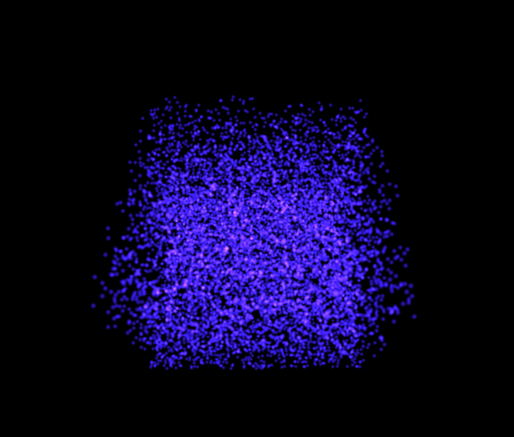

# SimuWebGPU

This project is a port of my OpenGL particle simulator to WebGPU. OpenGL is pretty archaic technology by today's standards and I am beggining to be convinced of the wonders of cross platform gpu development on the web. Because of this, I have been spending a good amount of time learning webgpu and I plan to continiously update this project as I learn new things. 

### features (so far):
simulation runs entirely on compute shader 
particles are instance renderered
particles rendered as billboards (quads that always face the camera to give the appearance of a 3D sphere)
fragment shader turns quad into a particle by alpha clipping.

> [!Note]
> how to run:

```bash
npm install
npm i wgpu-matrix dat.gui
npm i -D @types/dat.gui @webgpu/types
npm run dev
```


